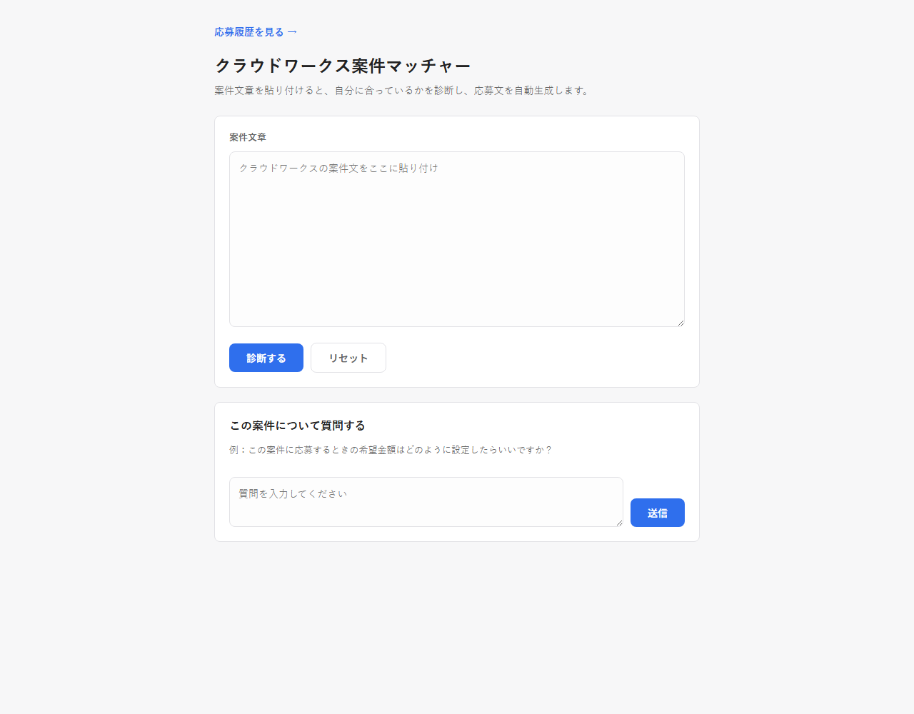

# クラウドワークス案件マッチャー

自分のプロフィールをもとに、案件の診断・応募文生成・クライアントへの返信作成を支援するローカルアプリです。

[作品一覧](https://github.com/moedaichi0629-ai/landing-page) · [ポートフォリオ](https://moedaichi0629-ai.github.io/)

## 解決する課題

**想定利用者：** 個別案件の応募判断や文面作成を効率化したい利用者

同じプロフィール情報を使って案件ごとに応募判断・文面作成を繰り返す手間。

## 主な機能

- プロフィールに基づく案件診断
- 応募文生成
- 返信スレッドの文脈を踏まえた返信作成

## デモ・利用方法

公開デモはありません。PC上でローカル起動して使用します。

## 使用技術

Python / FastAPI / SQLite / Anthropic API / Jinja2

## 工夫した点

案件診断・応募文・返信でプロンプトを分け、返信の文脈を継続して扱います。

## セットアップ・技術詳細

<details>
<summary>操作方法・構成・設定手順などの詳細を開く</summary>

クラウドワークスの案件ページの文章を貼り付けるだけで、AIが自分に合っているかを診断し、
応募文の作成から返信対応まで一気通貫でサポートするローカルWebアプリです。

---

## 目次

1. [アプリ概要](#アプリ概要)
2. [作成背景](#作成背景)
3. [アプリURL](#アプリurl)
4. [スクリーンショット](#スクリーンショット)
5. [使用技術](#使用技術)
6. [機能一覧](#機能一覧)
7. [セットアップ手順](#セットアップ手順)
8. [ディレクトリ構成](#ディレクトリ構成)
9. [工夫した点](#工夫した点)
10. [今後追加したい機能](#今後追加したい機能)
11. [学んだこと](#学んだこと)

---

## アプリ概要

クラウドワークスの案件探し〜応募〜クライアント対応までをAIでサポートする、個人利用のローカルWebアプリです。

- 案件文章を貼り付けるだけで、自分のプロフィールとの適合度を◎○△✕とスコアで診断
- 診断結果を踏まえて、案件ごとにパーソナライズされた応募文を自動生成
- 「希望金額はどう設定すればいい？」など、応募に関する疑問をAIに相談できるチャット機能
- 「応募済みにする」で案件を履歴として保存し、クライアントから返信が来たら文脈を踏まえた返信案を生成
- Windows起動時にサーバーが裏で自動起動し、デスクトップアイコンからアプリ風ウィンドウで開ける

---

## 作成背景

クラウドワークスで案件を探す際、1件ずつ「自分に合っているか」「いくらで応募すべきか」「応募文をどう書くか」を考えるのに時間がかかっていました。特に、対応可能な業務・得意分野・稼働時間といった条件は毎回同じなのに、その都度案件文を読み込んで判断するのは非効率だと感じていました。

また、応募後にクライアントから返信が来た際、それまでのやり取りの文脈を踏まえた返信を考えるのにも時間がかかります。

そこで、自分のプロフィールを一度だけ定義しておけば、案件の診断・応募文生成・返信対応までをAIがサポートしてくれるツールを作成しました。個人の業務効率化を目的とした、Claude Codeとの対話によるAIツール活用開発の実践例でもあります。

---

## アプリURL

個人の案件対応情報を扱うローカル専用アプリのため、公開URLはありません。
セットアップ手順に従うことで、誰でも自分のPC上で動かすことができます。

---

## スクリーンショット



---

## 使用技術

### バックエンド

| 技術 | 用途 |
|------|------|
| Python | 実装言語 |
| FastAPI | Webフレームワーク・APIサーバー |
| Uvicorn | ASGIサーバー |
| Jinja2 | サーバーサイドHTMLテンプレート |
| SQLite（標準ライブラリ） | 応募履歴・返信スレッドの永続化 |
| python-dotenv | 環境変数（APIキー）管理 |
| pip-system-certs | Windows証明書ストアを利用したTLS検証エラーの解消 |

### AI

| 技術 | 用途 |
|------|------|
| Anthropic API（Claude Sonnet 4.5） | 案件診断・応募文生成・チャット相談・返信案生成のすべてを担当 |

### フロントエンド

素のHTML / CSS / JavaScript（フレームワーク不使用）。`fetch` によるAPI通信とDOM操作のみで実装しています。

### Windows自動化

| 技術 | 用途 |
|------|------|
| バッチファイル（.bat） | 初回セットアップ・サーバー起動の自動化 |
| VBScript（.vbs） | コンソールウィンドウを表示せずサーバーをバックグラウンド起動 |
| スタートアップフォルダ | 管理者権限なしでのログオン時自動起動 |
| Edge/Chromeアプリモード（`--app=`） | アドレスバーの無いネイティブアプリ風ウィンドウでの起動 |

---

## 機能一覧

- [x] 案件文章の貼り付け→AI診断（◎/○/△/✕の4段階判定 + 0〜100点スコア + 観点別の判定理由）
- [x] 診断結果を踏まえたパーソナライズ応募文の自動生成（編集・コピー可能）
- [x] 案件について自由に相談できるAIチャット（希望金額の考え方、応募文の書き方など）
- [x] 「この案件を応募済みにする」でSQLiteに履歴保存
- [x] 応募履歴の一覧・詳細ページ（判定バッジ・保存日時・やり取り件数を表示）
- [x] クライアントからの返信を貼り付けると、これまでの案件文・応募文・やり取り全体を踏まえた返信案を生成
- [x] 何往復でも会話を継続できる返信スレッド管理
- [x] 「リセット」「次の案件へ」で入力・診断結果・チャット履歴を一括クリア
- [x] プロフィール（対応可能業務・得意分野・使用ツール・稼働時間・ポートフォリオURL）を1ファイルで一元管理
- [x] PCログオン時にサーバーが自動でバックグラウンド起動（コンソールウィンドウ非表示）
- [x] デスクトップアイコンからアドレスバー無しのアプリ風ウィンドウで起動

---

## セットアップ手順

### 1. リポジトリをクローン

```bash
git clone https://github.com/moedaichi0629-ai/crowdworks-matcher.git
cd crowdworks-matcher
```

### 2. 仮想環境を作成して有効化

```bash
python -m venv venv
# Windows
venv\Scripts\activate
# macOS / Linux
source venv/bin/activate
```

### 3. 依存パッケージをインストール

```bash
pip install -r requirements.txt
```

### 4. `.env` ファイルを作成し、Anthropic APIキーを設定

```bash
cp .env.example .env
```

`.env` を編集し、[Anthropic Console](https://console.anthropic.com/) で発行したAPIキーを設定します。

```env
ANTHROPIC_API_KEY=sk-ant-...
```

### 5. サーバーを起動

```bash
uvicorn app:app --reload
```

ブラウザで [http://127.0.0.1:8000](http://127.0.0.1:8000) を開くとアプリが表示されます。

### 6.（Windows・任意）ワンクリック起動・自動起動の設定

- `start.bat` をダブルクリックすると、venv作成・`.env`セットアップ・依存パッケージ確認・サーバー起動・ブラウザオープンまで自動で行われます（初回セットアップ用）
- PCログオン時に裏でサーバーを自動起動したい場合は、`run_server_hidden.vbs` へのショートカットをスタートアップフォルダ（`shell:startup`）に配置します
- `open_app.bat` はサーバーの起動確認とアプリ風ウィンドウ（`--app=` モード）での起動を行うため、デスクトップショートカットの参照先として利用できます

### 7. プロフィールを自分用に編集

診断・応募文生成の基準となるプロフィールは `profile.py` に定義されています。対応可能業務・得意分野・使用ツール・稼働時間・ポートフォリオURLなどを自分の情報に書き換えてください。

---

## ディレクトリ構成

```
crowdworks-matcher/
├── app.py                     # FastAPIエントリーポイント（全APIエンドポイント）
├── db.py                      # SQLite永続化層（応募履歴・返信スレッド）
├── profile.py                 # プロフィール定数（診断・応募文生成の基準）
├── prompts.py                 # Claudeへ渡すプロンプトテンプレート
├── templates/
│   ├── index.html             # メイン画面（診断・応募文生成・チャット）
│   └── history.html           # 応募履歴一覧・詳細画面
├── static/
│   ├── style.css              # 共通スタイル
│   ├── script.js              # メイン画面のロジック
│   └── history.js             # 応募履歴画面のロジック
├── data/                      # SQLiteデータベース（Gitに含まない）
├── logs/                      # バックグラウンドサーバーのログ（Gitに含まない）
├── screenshots/                # READMEのスクリーンショット
├── requirements.txt
├── .env.example
├── .gitignore
├── start.bat                  # 初回セットアップ・手動起動用（コンソール表示）
├── start_server_silent.bat    # サーバーをバックグラウンドで起動
├── run_server_hidden.vbs      # コンソールウィンドウを隠してサーバーを起動
└── open_app.bat                # サーバー起動確認 + アプリ風ウィンドウで開く
```

---

## 工夫した点

### 構造化出力の頑健なパース
案件診断はJSON形式でAIに出力させていますが、コードブロックで囲まれて返る、前後に説明文が付くといったケースに備え、正規表現でJSON部分を抽出したうえでパースし、失敗時は1回リトライする実装にしています。

### 機能ごとに独立したプロンプト設計
「診断」「応募文生成」「案件相談チャット」「返信案生成」の4つの機能それぞれに専用のプロンプトを用意し、プロフィール・案件文章・診断結果・応募文・やり取り履歴のうち必要な情報だけを渡すことで、目的に対して精度の高い出力を得られるようにしています。

### 返信スレッドの文脈継続
クライアントとのやり取りは何度でも続く前提で設計し、過去の「クライアントのメッセージ」と「送った返信案」をすべてプロンプトに含めることで、2回目以降の返信案も会話の流れを踏まえた内容になるようにしています。

### 管理者権限不要のWindows自動化
当初はタスクスケジューラでのログオン時自動起動を試みましたが、実行環境の権限制約で登録に失敗しました。代わりにWindows標準のスタートアップフォルダ（`shell:startup`）にVBScriptのショートカットを配置する方式に切り替え、管理者権限なしでバックグラウンド常駐を実現しています。

### TLS証明書エラーへの対応
Windows環境でセキュリティソフトのHTTPS検査機能が働いていると、WindowsのOS自体は証明書を信頼していてもPython（httpx/certifi）側では検証に失敗し `CERTIFICATE_VERIFY_FAILED` でAPI接続が失敗することがありました。`pip-system-certs` を導入し、PythonがWindowsの証明書ストアをそのまま利用するようにすることで解決しています。

### 軽量な永続化
応募履歴のような個人利用規模のデータに対して外部DBサーバーは過剰と判断し、Python標準ライブラリの `sqlite3` のみでファイルベースの永続化を実装しています。追加の依存パッケージやミドルウェアなしで、応募案件と返信スレッドを関連付けて管理できます。

---

## 今後追加したい機能

- [ ] 応募履歴の検索・絞り込み（判定・キーワード・期間など）
- [ ] 複数プロフィールの切り替え（案件ジャンルごとに使い分け）
- [ ] 案件URLを直接読み込んでの自動診断
- [ ] 応募〜返信〜成約までのステータス管理（カンバン形式など）
- [ ] クラウド版としてのデプロイ対応（現状はローカル専用）

---

## 学んだこと

- **FastAPI + Jinja2のAPI変更対応** — Starletteのバージョンアップで `TemplateResponse` の引数順序（`(request, name)`）が変わっており、旧来の `(name, {"request": request})` 形式では実行時エラーになることを実際のデバッグを通じて学びました
- **Anthropic SDKの例外階層** — `anthropic.APIConnectionError` は `anthropic.APIStatusError` の兄弟クラスであり、`except APIStatusError` だけでは接続エラーを捕捉できないという落とし穴に対応しました
- **Windows環境特有のTLS問題の切り分け方** — `curl -v` でのschannelエラーとPythonの `CERTIFICATE_VERIFY_FAILED` を比較することで、Windowsの証明書ストアとPython（certifi）の証明書ストアが別物であることを突き止め、`pip-system-certs` による解決に至りました
- **Windowsのバッチファイルと文字コード** — 日本語を含むバッチファイルをUTF-8（BOM無し）+ LF改行で保存すると `cmd.exe` が正しく解釈できず文字化けすることを確認し、CRLF改行への変換とASCII文字での記述で回避しました
- **管理者権限が必要な自動化とそうでない自動化の切り分け** — タスクスケジューラへの登録は環境によって権限エラーになり得る一方、スタートアップフォルダへのショートカット配置は通常のファイル操作権限のみで完結するため、より制約の少ない代替手段になることを学びました
- **UIの状態管理の基本的な落とし穴** — ローディング中にボタンを無効化する処理で、ローディング終了時に有効化し忘れるとボタンが恒久的に無効化されたままになるというシンプルながら見落としやすいバグを経験しました

</details>

